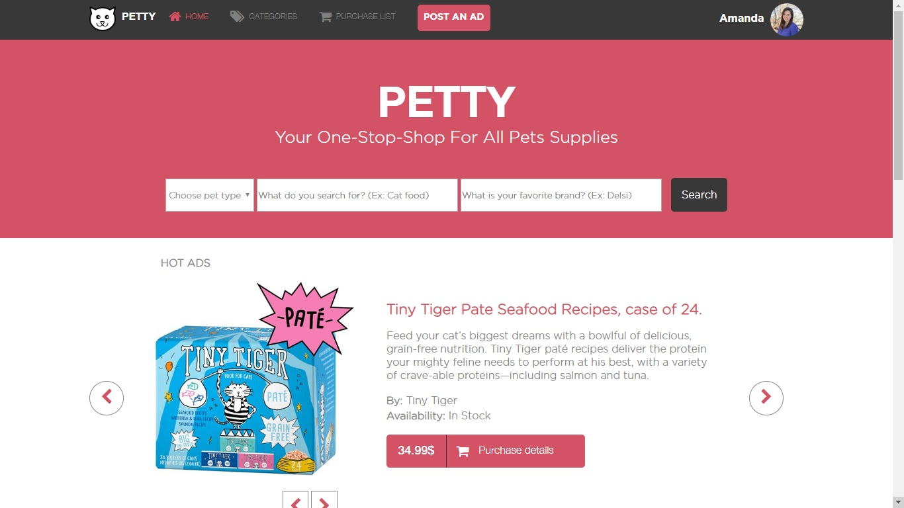

# A Website for Pets Supplies Shop.

The is a website for Pets Supplies shop where the customers can search for the product they need by pet type, product name and product brand, and they can also create an account on the website and order online.

Also the vendors can post an Ads for their related products on the website.

For educational purposes this project contains only 2 pages, home page and search results page. 

- No javascript effects.
- No Back-end.

## Built With

- HTML.
- CSS.
- CSS Grid.
- CSS Flexbox.
- CSS Float.

## Live Demo

[Live Demo Link](https://raw.githack.com/AhmedTohamy01/Pets-Food-Shop/Main-Layout-Pets-Shop/index.html)

## Authors

👤 **Ahmed Tohamy**

- Github: [@githubhandle](https://github.com/AhmedTohamy01)
- Twitter: [@twitterhandle](https://twitter.com/AhmedTohamy01)
- Linkedin: [linkedin](https://www.linkedin.com/in/ATohamy)

## Show your support

Give a ⭐️ if you like this project!

## Acknowledgments

- Hat tip to anyone who helped me to learn the technology used in building this website.
- Thanks for the design idea by Mohamed Awad on Behance https://www.behance.net/gallery/24796463/ZATTIX. 
